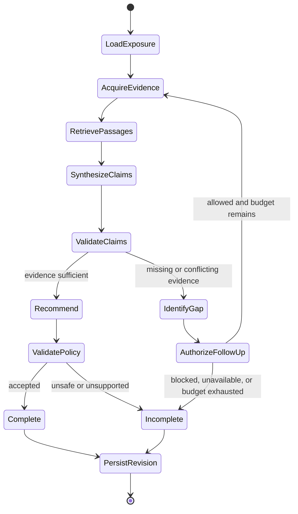

# Bounded investigation graph

## Model-owned judgments

- Interpret source-aware passages in repository context.
- Draft atomic extracted facts and labeled inferences.
- Identify an Evidence Gap or material contradiction.
- Propose one follow-up from an enumerated evidence-tool vocabulary.
- Propose one allowed Recommendation with evidence-linked reasoning.

## Deterministic controls

- Select repository, source, model, and embedding targets.
- Parse dependencies and match affected version ranges.
- Enforce C0-C1/A0-A1 capability, tool, transition, time, and call budgets.
- Validate follow-up targets and tool arguments.
- Validate Claim structure, citation existence, provenance, and allowed Recommendation vocabulary.
- Downgrade unsupported or conflicted results to `More Evidence Required`.
- Persist events, checkpoints, and immutable revisions transactionally.

## Initial limits per revision

- 5 generation-model calls
- 15 tool calls
- 12 graph transitions
- 2 minutes wall time
- Configurable monetary ceiling for future hosted providers

Crossing any limit produces an incomplete revision; it never triggers an unrecorded retry or fallback provider.
