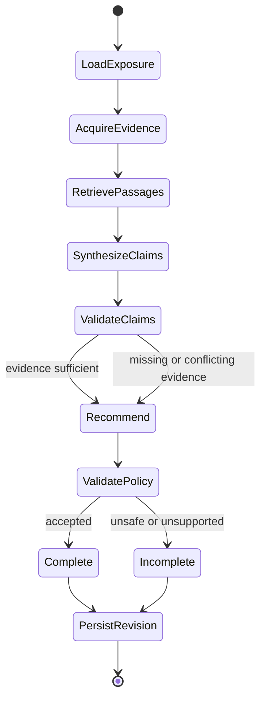

# Bounded investigation graph

## Model-owned judgments

- Interpret source-aware passages in repository context.
- Draft atomic extracted facts and labeled inferences.
- Propose one allowed Recommendation with evidence-linked reasoning.

## Deterministic controls

- Select repository, source, model, and embedding targets.
- Parse dependencies and match affected version ranges.
- Enforce C0-C1/A0-A1 capability, tool, transition, time, and call budgets.
- Validate Claim structure, citation existence, provenance, and allowed Recommendation vocabulary.
- Downgrade unsupported or conflicted results to `More Evidence Required`.
- Persist events and immutable revisions transactionally.

## Initial limits per revision

- 5 generation-model calls
- 15 tool calls
- 12 graph transitions
- 2 minutes wall time

Crossing any limit stops evidence, retrieval, and model work and produces an incomplete revision; it never triggers an unrecorded retry or fallback provider. Immutable Revision persistence is the mandatory post-budget finalization step and does not authorize additional Investigation work.

Evidence Gap follow-ups and LangGraph checkpoint resumption are future extensions. The initial graph
runs one fixed pass; interrupted work is reclaimed through the PostgreSQL Assessment lease and starts
a new immutable Revision.
