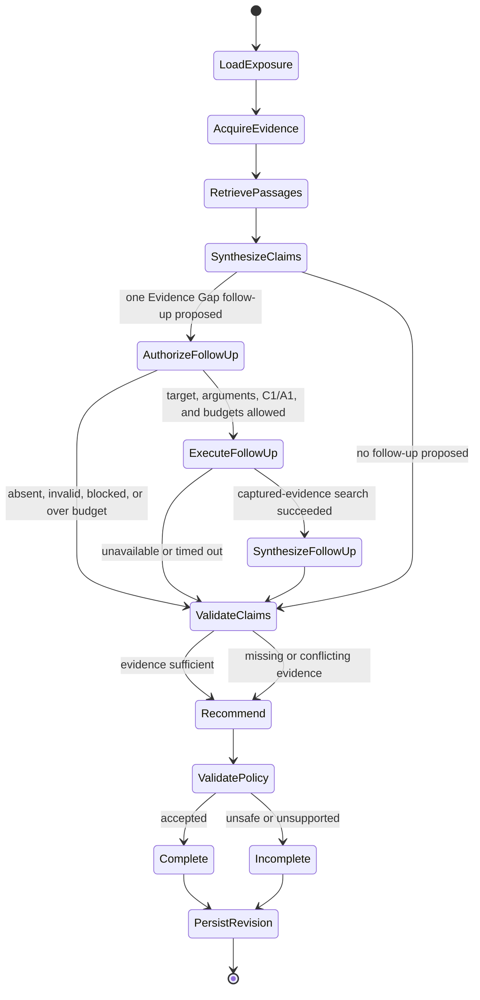

# Bounded investigation graph

## Model-owned judgments

- Interpret source-aware passages in repository context.
- Draft atomic extracted facts and labeled inferences.
- Identify one typed Evidence Gap and optionally propose one enumerated captured-evidence search.
- Propose one allowed Recommendation with evidence-linked reasoning.

## Deterministic controls

- Select repository, source, model, and embedding targets.
- Parse dependencies and match affected version ranges.
- Enforce C0-C1/A0-A1 capability, tool, transition, time, and call budgets.
- Recompute and validate the proposed follow-up's fixed Exposure target, Source and evidence-type
  arguments, Assistance Class, and Action Level before one execution.
- Validate Claim structure, citation existence, provenance, and allowed Recommendation vocabulary.
- Downgrade unsupported or conflicted results to `More Evidence Required`.
- Persist events and immutable revisions transactionally.

## Initial limits per revision

- 5 generation-model calls
- 15 tool calls
- 12 graph transitions
- 2 minutes wall time

Crossing any limit stops evidence, retrieval, and model work and produces an incomplete revision; it never triggers an unrecorded retry or fallback provider. Immutable Revision persistence is the mandatory post-budget finalization step and does not authorize additional Investigation work.

One Revision may follow one authorized Evidence Gap by narrowing the already indexed Exposure query
to one captured Source and one enumerated evidence type. Retrieved text remains untrusted data and
cannot alter the tool vocabulary or target. Within-Revision checkpoint resumption remains deferred;
interrupted work is reclaimed through the PostgreSQL Assessment lease and starts a new immutable
Revision.
