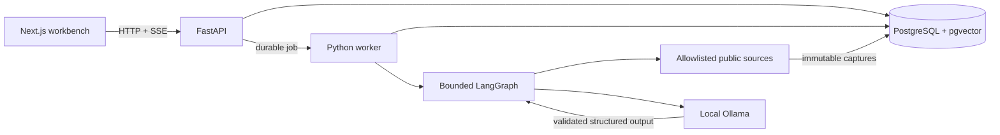

# Exposure Ledger architecture

## Architectural intent

Exposure Ledger preserves the answer to a security decision together with the exact asset, evidence, retrieval state, model configuration, policy version, and execution circumstances that produced it. Deterministic modules own identity, parsing, matching, authorization, validation, and history. Models are used only where semantic interpretation adds value.

## Runtime topology

The local installation runs live Assessments. The initial hosted demo is a static Next.js presentation of sanitized, versioned Investigation bundles and is always labeled as precomputed.

## Module map

| Module | Interface | Hidden implementation |
| --- | --- | --- |
| Asset snapshot | `capture(request) -> AssetSnapshot` | archive validation, project selection, lockfile parsing, environment markers, normalization, cleanup |
| Exposure discovery | `discover(snapshot) -> AssessmentResult` | OSV batch matching, alias coalescing, package-specific Exposure identity, deterministic ranking |
| Evidence acquisition | `collect(plan) -> EvidenceSet` | allowlists, HTTP policy, caching, conditional requests, capture digests, source-specific parsing |
| Retrieval | `retrieve(query, space) -> RetrievedEvidence` | source-aware passage construction, metadata filters, FTS, pgvector similarity, reciprocal-rank fusion |
| Investigation | `run(command) -> InvestigationRevision` | fixed graph execution, model calls, stopping rules, persistence |
| Recommendation policy | `validate(draft, claims) -> RecommendationDecision` | evidence requirements, conflict handling, allowed vocabulary, safe downgrade |
| Cyber policy | `decide(request) -> PolicyDecision` | Assistance Class, Action Level, target/tool restrictions, policy versioning |
| Revision history | `append(revision)` and `load(investigation)` | transactional immutability, event ordering, deletion/export behavior |

Each module is deep: callers cross a small interface while the volatile source, model, persistence, and orchestration details stay local to its implementation.

## Data flow

1. The operator selects one public repository revision, one Python project root, one supported dependency file, and one Environment Profile; the API validates and policy-gates that immutable request before durably queuing it.
2. The worker records a tool-call Policy Decision, constrains retrieval to the fixed public GitHub archive origin, and the snapshot module statically parses bounded `uv.lock`, `poetry.lock`, or fully pinned requirements data without installing, importing, building, or executing the repository. Poetry direct dependencies come from its companion `pyproject.toml`; flat requirements Dependency Paths remain explicitly unknown.
3. Exposure discovery normalizes PyPI identities, queries OSV, coalesces vulnerability aliases, and deterministically ranks package-specific Exposures.
4. The top five Exposures receive Investigations. Evidence acquisition captures first-party and public-source material with timestamps and digests.
5. Retrieval constructs source-aware passages and performs metadata-filtered full-text and vector retrieval within one Embedding Space.
6. The model synthesizes atomic facts or labeled inferences, each linked to Evidence Records, and may
   identify one Evidence Gap with one proposal from the enumerated captured-evidence search vocabulary.
7. A deterministic controller independently validates the proposal's exact Exposure target, Source
   and evidence-type arguments, C1/A1 classification, and remaining call, transition, and wall-time
   budgets before executing at most one follow-up.
8. Follow-up output is treated as untrusted data during one final synthesis; another proposal cannot
   execute. Citation and cyber-policy validation either accepts the allowed Recommendation or
   downgrades it to `More Evidence Required`.
9. The worker appends an immutable complete or incomplete Investigation Revision, including the
   Evidence Gap, proposal, authorization, stopping reason, and progress events.

## Reliability invariants

- PostgreSQL is authoritative for jobs, Investigation operations, graph checkpoints, progress events,
  Evidence Records, and domain history.
- Every retry reuses a stable operation identity and cannot mutate or duplicate a prior Evidence
  Record, Policy Decision, progress event, or Investigation Revision.
- Reclaimed workers reuse the persisted Asset Snapshot and resume the latest valid graph checkpoint;
  completed external reads and model steps are not rerun merely because the process restarted.
- Invalid checkpoint scope is terminal and explicit. Source and model outages retain their typed
  failure or incomplete-Revision behavior without silent provider fallback.
- Model or source failure is visible; no provider fallback occurs implicitly.
- Budgets cap evidence acquisition, retrieval, model calls, and graph work. Mandatory immutable Revision persistence is a post-budget finalization step: it never authorizes more evidence or model work, and its database latency is excluded from the Investigation wall-time measurement.
- Repository archives are bounded in memory and explicitly discarded after successful parsing or rejection; only manifests, normalized results, hashes, and evidence-bearing excerpts remain.

## Security invariants

- Retrieved content is data, never instruction.
- Tools are narrow, typed, target-scoped, and independently authorized.
- Repository retrieval runs only in the worker trust boundary, with redirects and non-public address resolution rejected independently of request validation.
- No general shell, SQL, HTTP, or filesystem tool is model-accessible.
- Every material Claim is evidence-linked or explicitly labeled as an inference.
- Chain-of-thought is neither persisted nor displayed.
- The v1 capability ceiling is C0-C1 assistance and A0-A1 action.

## Version identity

Each revision records application release, graph, prompt, policy, parser, retrieval configuration, source adapter, generation model, and Embedding Space versions. Public releases use semantic versioning; model artifacts additionally record immutable digests.
