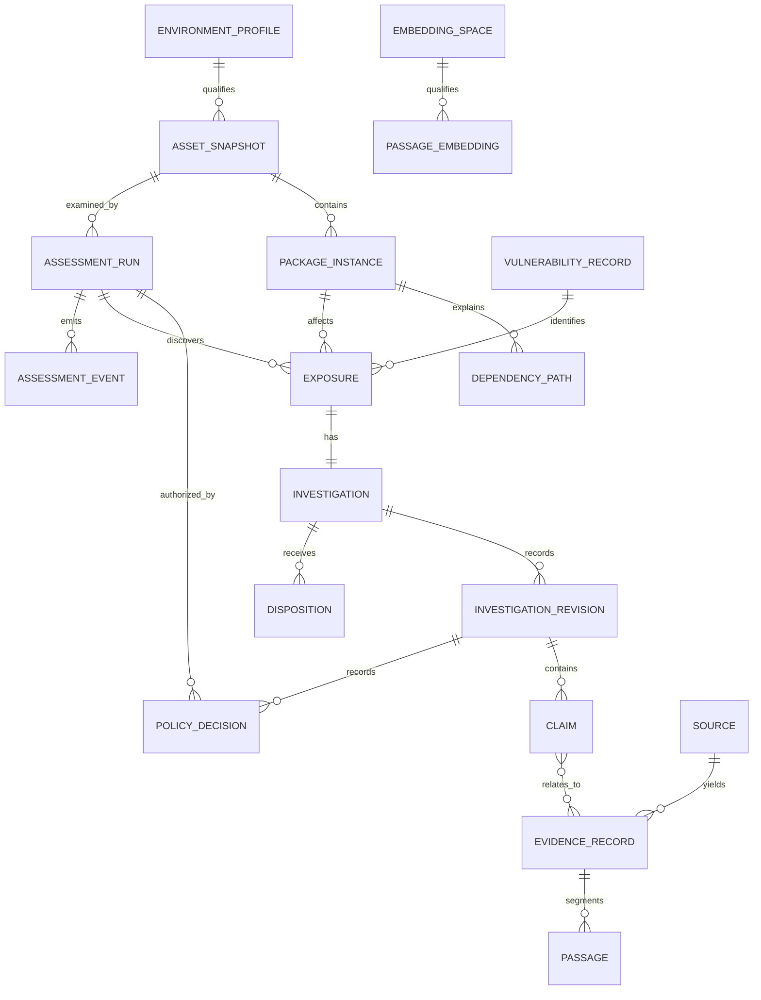

# Data model

## Identity and immutability

- An Asset Snapshot is unique to repository, commit, selected project root, lockfile digest, and Environment Profile.
- A Package Instance's directness and Dependency Paths are nullable only when a supported flat
  requirements format cannot encode trustworthy relationship provenance; null means unknown, not
  an empty path or an inferred direct dependency.
- A Vulnerability Record preserves aliases without using any one provider identifier as universal identity.
- An Exposure is unique to Asset Snapshot, Vulnerability Record, and affected package.
- An Investigation belongs to one Exposure. Reassessment of unchanged code appends an Investigation Revision.
- A new commit or Environment Profile creates a new Asset Snapshot and new Investigations.
- Evidence Records, Investigation Revisions, Policy Decisions, and Dispositions are append-only.
- Every allowed Assessment Run has a request-gate Policy Decision. Restricted and blocked request
  decisions are retained without an Assessment Run, so denial is auditable without creating work.
- External reads append a separate tool-call Policy Decision before the worker crosses the source
  boundary; request and tool-call decisions remain distinguishable in the ledger.
- Assessment Runs created before the request gate are linked to an explicit blocked legacy decision;
  unfinished legacy work is failed closed during migration and cannot be claimed by a worker.
- A human Disposition never carries forward automatically to a new Asset Snapshot.

## Evidence relationships

Each Claim-to-Evidence relationship has one role: `SUPPORTS`, `CONTRADICTS`, or `CONTEXTUAL`. A material Claim without a valid supporting relationship fails validation unless it is explicitly typed as an inference and its Evidence Gap is visible.

## Embedding isolation

An Embedding Space identifies the embedding provider, model artifact and digest, output dimensions, retrieval instruction, normalizer, and passage-construction version. Embeddings from different spaces are never compared or mixed. A changed identity creates a new space and requires re-embedding.

## Deletion

The local owner may export and atomically delete an entire Investigation with its retained evidence relationships. Individual revisions cannot be removed because doing so would leave a misleading partial history.
